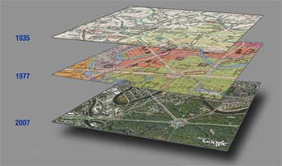

The prefix “hyper” refers to multiplicity and abundance. More than a physical space, a hypercity is a real city overlaid with information networks that document the past, catalyze the present, and project future possibilities. Hypercities are always under construction.

One project that uses hypercity technology is the Berlin Palace Reconstruction Project.

The site compiles articles that have to do with the reconstruction 

It also has interactive maps that show the geography of the area for the past geography and the future estimates.  

Google earth itself has these 

From what I’ve seen of the video (https://youtu.be/wQIC0U-xoWk) the Berlin Palace is a palace, in berlin, that has been scheduled for reconstruction. The rebuilt structure will house educational and cultural facilities. The first time that this palace was destroyed was in 1945 by aerial bombardment. The second time communist leader Walter Ulibricht ordered the leveling of the palace. The Berlin Palace rebuild is scheduled for completion in 2020. Maps that trace back to the middle ages, showed that there were plans to make the palace. The palace was completed in 1451. 

From viewing this project I was able to learn about this age old structure and its plans to be rebuilt in current year. All thanks to hypercities. 

This tool proves to be useful for documenting and cataloging historic events, tracking ancient monuments for the past, and is a great learning tool. 

Another example of a hypercities project is the Tehran Election protest project, that covers the event that took place in 2009. The hypercity project follows the route of the protest and provides videos of people that were there on that day. From watching the video (https://youtu.be/U3jJLUXs6_k) there was a protest brewing in 2009 and some protesters, who were also university students were beaten and shot to death for no good reason. An armed force group named the basij was responsible and they were trying to stop the protests by any means necessary. They began disrupting the protests by driving through crowds on motorcycles and beating the protestors.people who were  

GLEN
Research and Finding Questions - Glen and Eugene
Use the website/tool to create an outcome that explores the different tools and resources given. 
Make sure to label and record your outcomes in the research (this can include doing graphs, using voyant and etc)
I found a good example of how hypercities are used. Thick Mapping was used to illustrate the history of Filipino town in Los Angeles. Students were able to track their family history using the map. 

https://www.youtube.com/watch?v=V5WlVq6slDE&feature=emb_title

How good was the outcome? 
		I tried to use the map but the website was broken. A video of the map shows the
layers from each time period. This exemplifies the idea behind hypercities. The map shows the history of the city and how it developed. This is a good example of how hypercities are always under construction. The map also displayed helpful data such as census data. This is extremely useful when comparing time periods.  

Were the tools efficient? 
The website is very old and unreliable. Some links are inaccessible or broken
I think that the website does not do a good job conveying the idea of hypercities.  

What would you have changed in the website/tool to better express your outcome? 
I would make the website more centered on the idea of hypercities. I think that it should have a tool that shows an example of thick mapping. I could not find one that I could interact with. A tool like this would be extremely helpful in understanding the idea of hypercities and thick mapping. I was only able to find a video and some image examples of a third party site. I think that the hypercities website needs to have something like this to demonstrate the concept.

What did you find most helpful and do you think you might use it in the future? 
Thick mapping is a good tool that I might use in the future to compare how cities are now to how they are in the future. Thick mapping is an amazing way to visualize geographical change.

The prefix “hyper” refers to multiplicity and abundance. More than a physical space, a hypercity is a real city overlaid with information networks that document the past, catalyze the present, and project future possibilities. Hypercities are always under construction.
